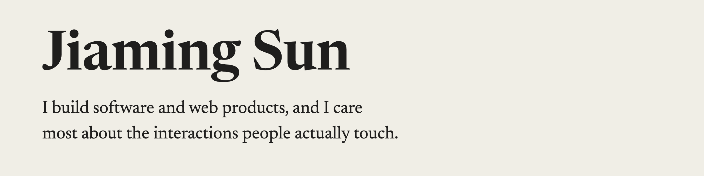

<a href="https://jiaming-sun-900.github.io/"><picture><source media="(prefers-color-scheme: dark)" srcset="assets/banner-dark.png"></picture></a>

<picture><source media="(prefers-color-scheme: dark)" srcset="assets/greenlight-dark.svg"></picture> [Greenlight](https://greenlight-f1.vercel.app): a job tracker for international students on F-1 visas that screens each posting for sponsorship signals.

<picture><source media="(prefers-color-scheme: dark)" srcset="assets/omni-geo-quiz-dark.svg"></picture> [Omni Geo Quiz](https://jiaming-sun-900.github.io/omni-geo-quiz/): a geography game with five modes, played on blank maps and satellite images.

<picture><source media="(prefers-color-scheme: dark)" srcset="assets/rubric-studio-dark.svg"></picture> [Rubric Studio](https://jiaming-sun-900.github.io/rubric-studio/): a tool for writing the rubrics that grade AI answers, built during my internship at [Mimir Systems](https://mimirsystems.ai/).
